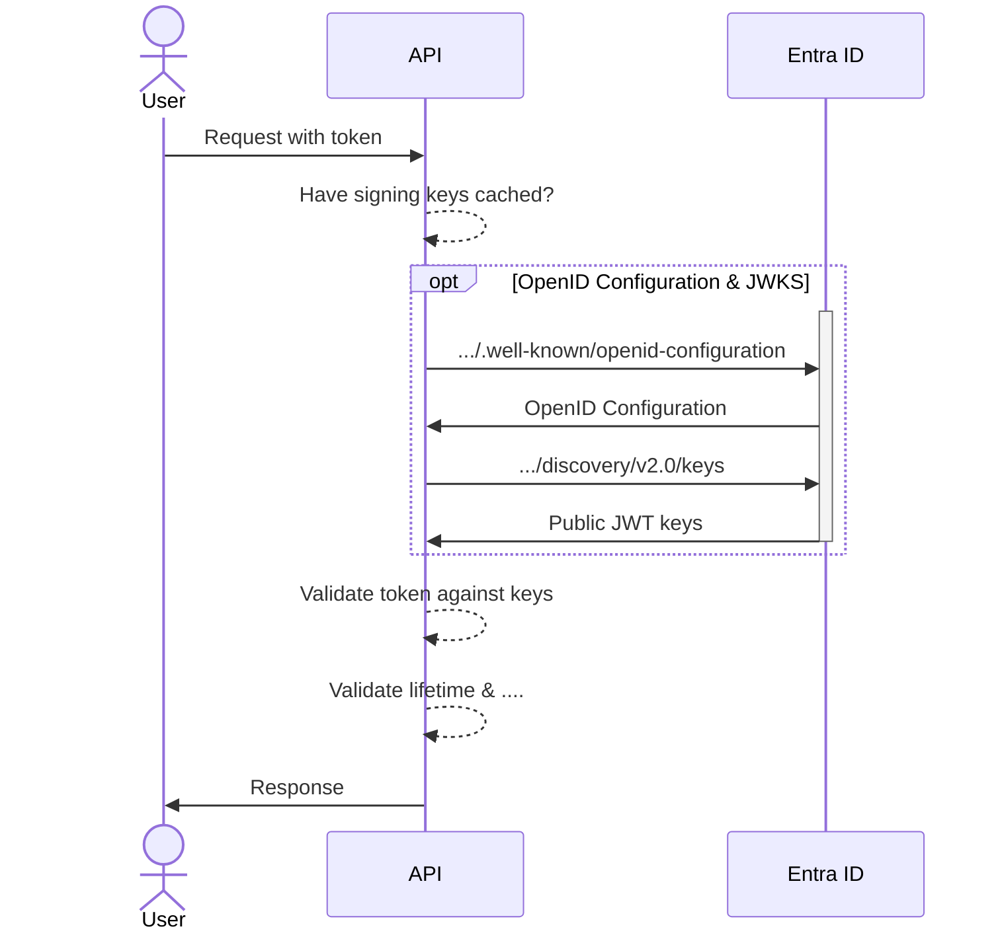
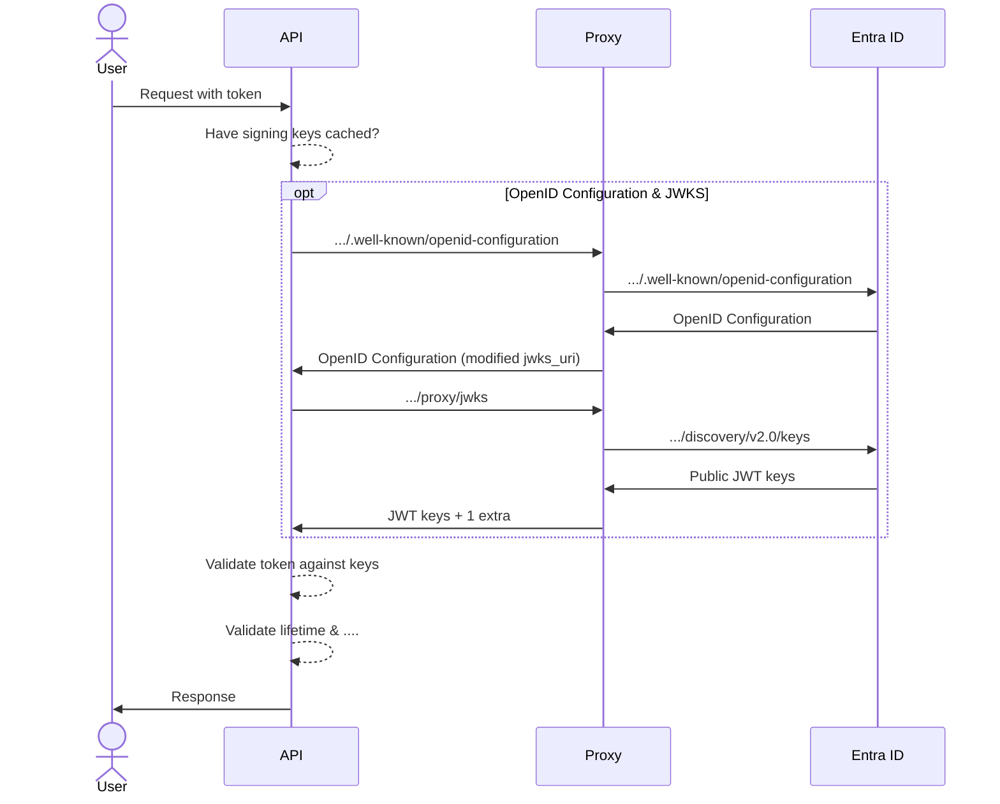
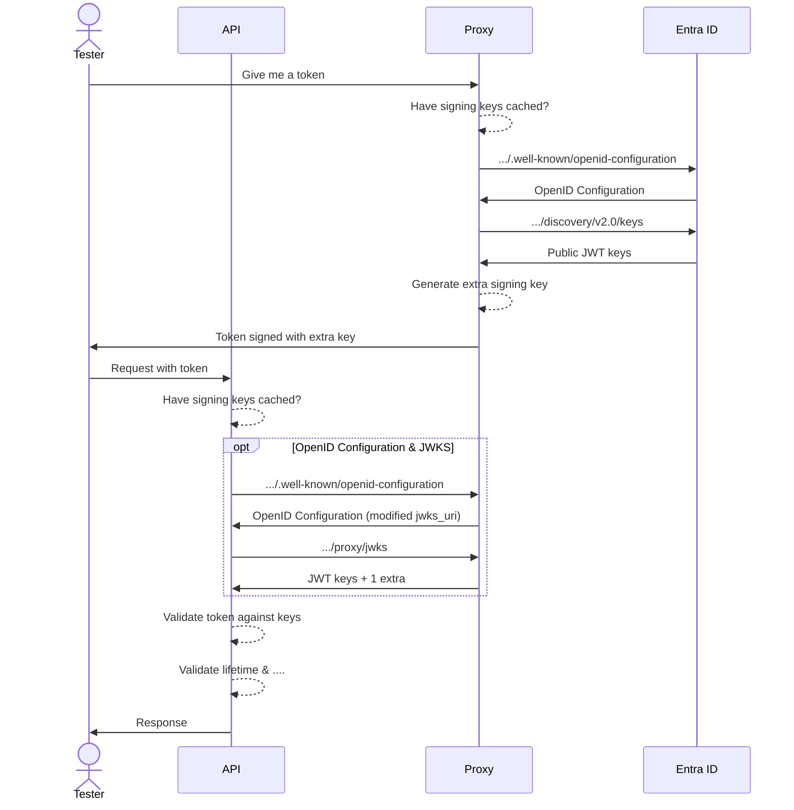

# 🔑 Introducing IdentityProxy 🔑

## Men-in-the-middle for OpenID Connect

---
layout: two-columns
transition: slideUp
title: Doing a request with token
---

::right::

# Token validation

1. Have signing keys cached?
1. If not, fetch OpenID Configuration
1. Fetch JWKS (JSON Web Key Set)
1. Validate token against keys
1. Validate lifetime & other claims

---
layout: two-columns
title: Inject extra signing keys
---

::right::

# Inject extra signing keys

1. Modify the `authority` to point to the proxy
1. Act as a proxy for OpenID Configuration
1. Change the `jwks_uri` to point to the proxy
1. Act as a proxy for JWKS
1. Inject extra signing keys into the JWKS response

---
layout: two-columns
title: Inject extra signing keys
---

::right::

# Inject extra signing keys

1. Modify the `authority` to point to the proxy
1. Act as a proxy for OpenID Configuration
1. Change the `jwks_uri` to point to the proxy
1. Act as a proxy for JWKS
1. Inject extra signing keys into the JWKS response

---
layout: section
transition: slideUp
---

# Introducing IdentityProxy

- Open-source project
- Docker container
- **TestContainer support** for integration tests
- Tested with Entra ID and Azure AD B2C
- DO NOT use in production 💣
 
https://github.com/svrooij/identityproxy/

---
layout: two-columns
title: Inject extra signing keys
transition: slideUp
---

::right::

# Get token during tests

1. Ask the proxy for a token with these claims
1. Proxy fetches OpenID Configuration and JWKS
1. Proxy generates an extra signing key
1. Proxy signs the token with the extra key
1. Proxy returns the token to the test
1. API validates the token as usual

---
layout: section
transition: slideUp
---

# 🔑 IdentityProxy 🔑

## 🧑‍💻 Demo time 🧑‍💻
