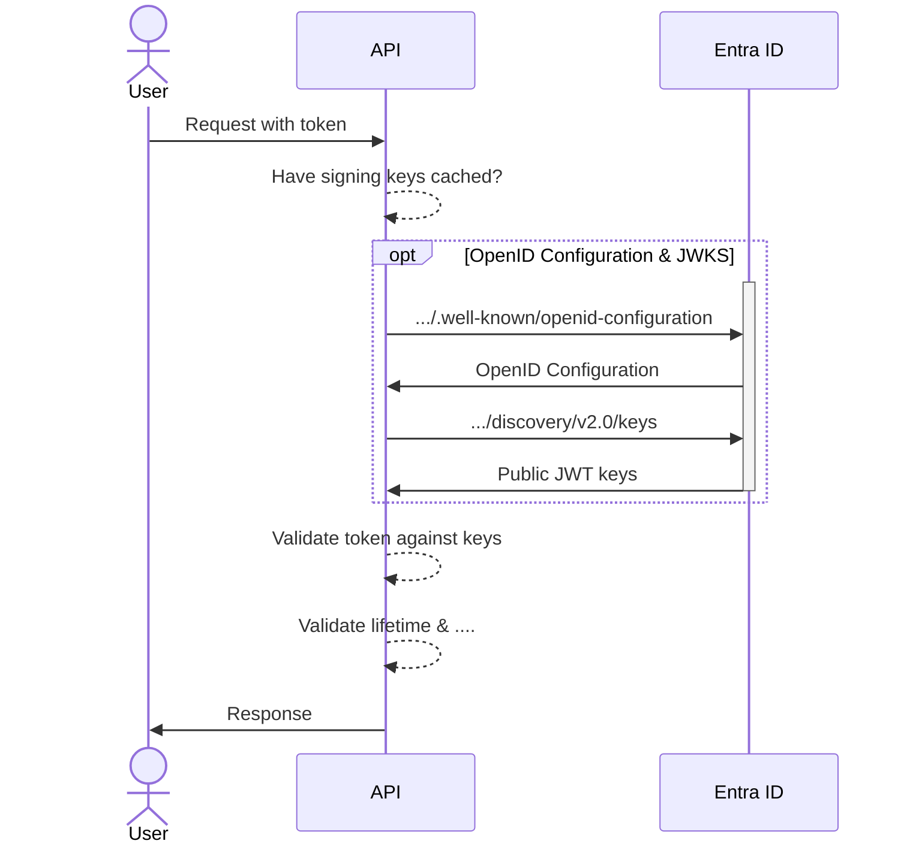
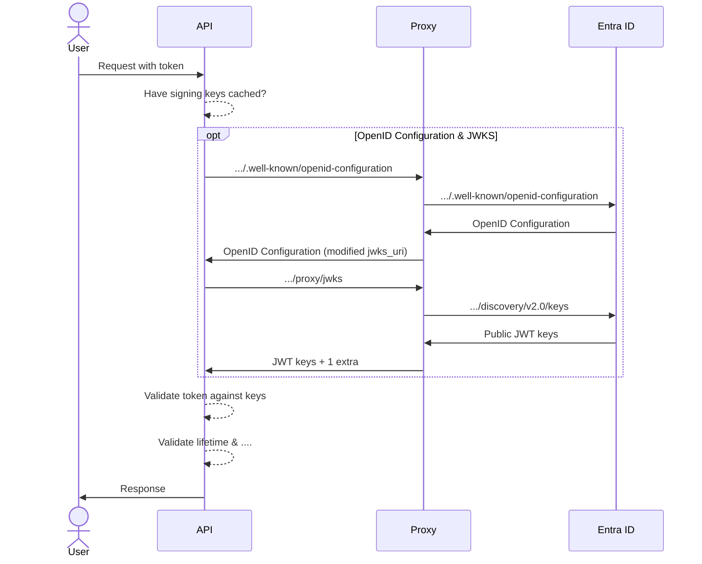

# 🥁 Introducing IdentityProxy 

---
layout: two-columns
transition: slideUp
title: Doing a request with token
---

::right::

# Token validation

1. Have signing keys cached?
1. If not, fetch OpenID Configuration
1. Fetch JWKS (JSON Web Key Set)
1. Validate token against keys
1. Validate lifetime & other claims

---
layout: two-columns
transition: slideUp
title: Inject extra signing keys
---

::right::

# Inject extra signing keys

1. Modify the `authority` to point to the proxy
1. Act as a proxy for OpenID Configuration
1. Change the `jwks_uri` to point to the proxy
1. Act as a proxy for JWKS
1. Inject extra signing keys into the JWKS response

---
layout: section
transition: zoomIn
---

# Introducing IdentityProxy 🔑

---
layout: default
transition: slideUp
---

# Introducing IdentityProxy 🔑

- Open-source project
- https://github.com/svrooij/identityproxy/
- Docker container
- **TestContainer support** for integration tests
- Tested with Entra ID and Azure AD B2C

## Demo Time 🧑‍💻
