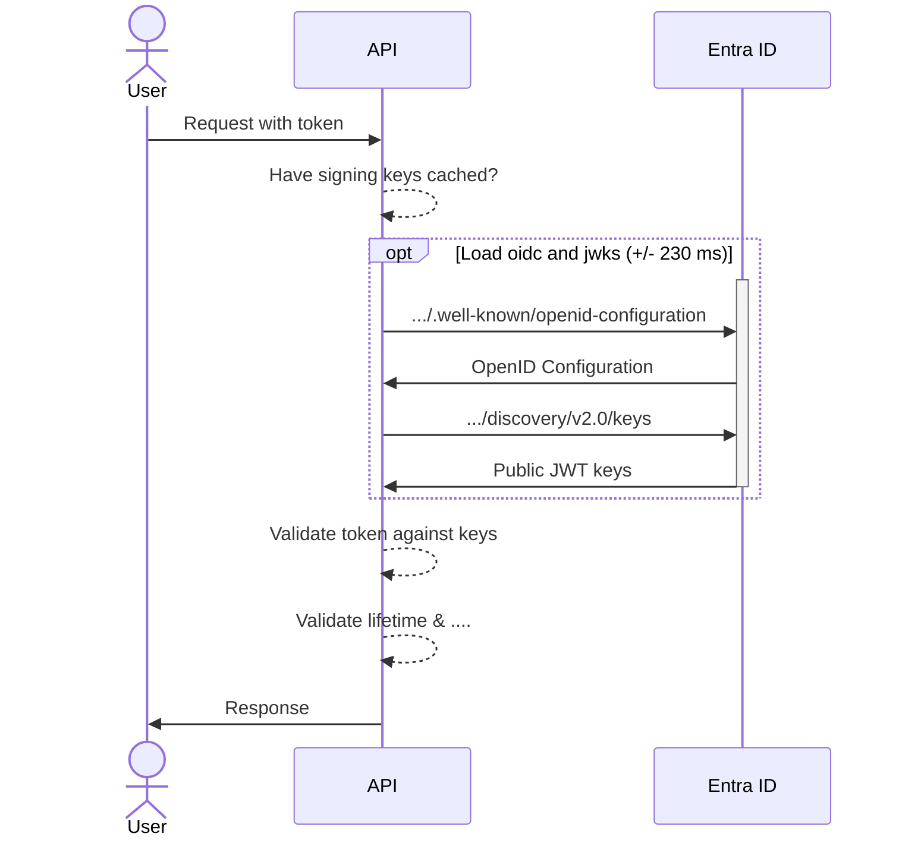

# How does JWT Authentication work? 🔐

---
layout: two-columns
transition: slideUp
title: Doing a request with token
---

::right::

# Token validation

1. Have signing keys cached?
1. If not, fetch OpenID Configuration
1. Fetch JWKS (JSON Web Key Set)
1. Validate token against keys
1. Validate lifetime & other claims

---
layout: image-right
image: .demo/slides/entra-openid-configuration.png
transition: slideUp
---

# OpenID Configuration

## Details about IDP

- Issuer
- Authorization endpoint
- Token endpoint
- JWKS URI
- ...

---
layout: image-right
image: .demo/slides/entra-jwks.png
transition: slideUp
---

# JSON Web Key Set (JWKS)

Just a bunch of public keys that can be used to validate JWTs.

---
layout: section
title: Configure JWT Authentication in .NET
---

# Configure JWT Authentication in .NET

## 🧑‍💻 Demo Time! 🧑‍💻
