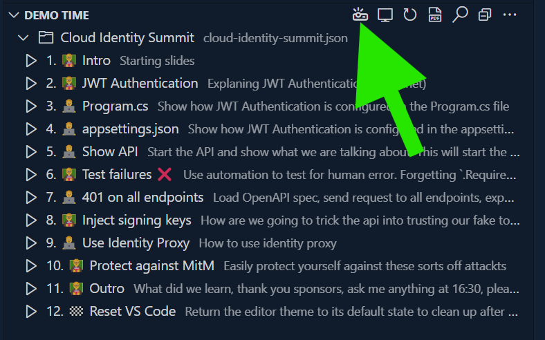

# Recipers

A simple recipe management application built with dotnet 10 and some modern frontend technologies. Showcasing using [IdentityProxy](https://github.com/svrooij/identityproxy) for running integration tests without disabling authentication.

## Demo-only ⚠️

> [!WARNING]
> This project is a demo and should be treated as such. It is not intended for production use and has some **intentional authentication error** and incomplete features.

## Slides

This repository contains all the slides and source code you've seen. You can find the slides in the `.demo/slides` directory.
If you clone this repository, and open it in Visual Studio Code, it will ask you to install the [DemoTime](https://demotime.show) extension 💖.

Once you install the extension, it allows you to view the exact presentation that was given during the conference.

## Stephan van Rooij

Check out my other projects on [GitHub](https://github.com/svrooij), check-out my [blog](https://svrooij.io) or connect with me on [LinkedIn](https://www.linkedin.com/in/stephanvanrooij/).
